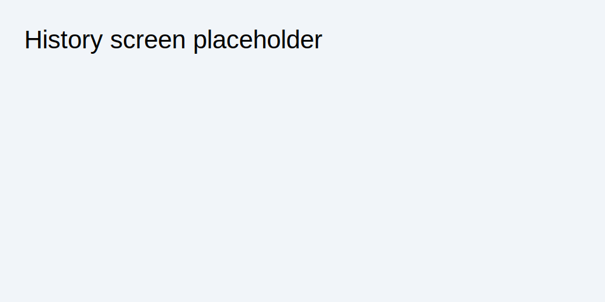
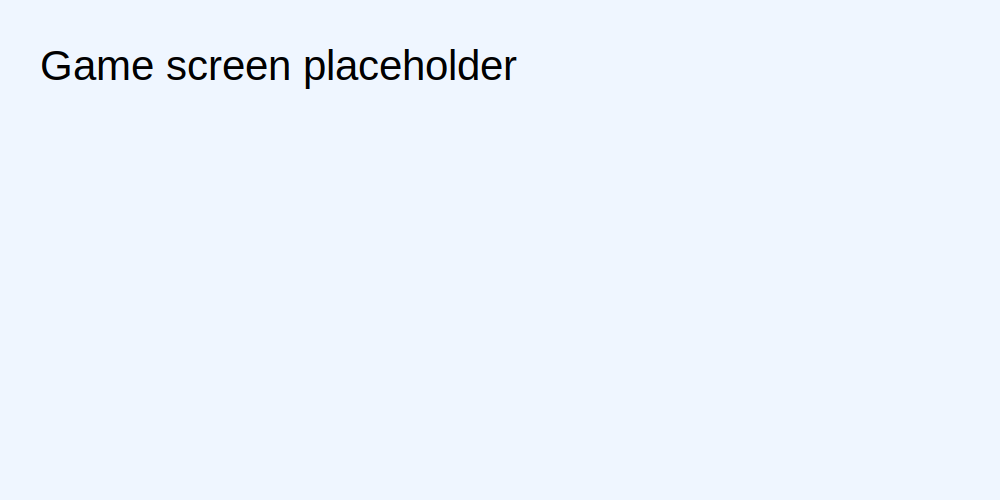

# Stuff Happens – Web Applications I exam project

Single-player SPA implementation of *Stuff Happens* with React 19 (client) and Node+Express+SQLite (server).

## Server-side HTTP APIs
- `POST /api/sessions` body `{ username, password }`: login, returns authenticated user.
- `GET /api/sessions/current`: retrieve current authenticated user.
- `DELETE /api/sessions/current`: logout.
- `POST /api/games` (auth): starts a full game, returns game id + initial 3 cards.
- `POST /api/demo-games`: starts one-round anonymous demo game.
- `GET /api/games/:id/round`: creates next round card (title+image only).
- `POST /api/games/:id/guess` body `{ slot, timedOut }`: evaluates insertion guess and updates game state.
- `GET /api/history` (auth): completed games list ordered by date with played cards.
- `GET /api/games/:id/summary`: final summary of won cards (title, image, index).

## Database tables
- `users`: registered users with salted+hashed password credentials.
- `cards`: archive of 50 horrible situations with unique bad luck index.
- `games`: metadata and outcome for each game session.
- `game_cards`: cards involved in each game (initial/round, won/lost, round number).

## Client-side routes
- `/`: instructions/home page and entry point.
- `/login`: login page for registered users.
- `/game`: main gameplay page (registered full game or anonymous demo).
- `/profile`: authenticated user history page.

## Main React components
- `App`: routing + top-level auth/session orchestration.
- `LoginPage`: credentials form and login workflow.
- `GamePage`: gameplay state machine (rounds, timer, guess placement, summary).
- `ProfilePage`: list of completed games with round-by-round outcomes.

## Screenshots
### User history


### During a game


## Registered users
- `alice` / `password`
- `bob` / `secret`

## Run commands
```bash
cd server
npm install
nodemon index.mjs
```
```bash
cd client
npm install
npm run dev
```
